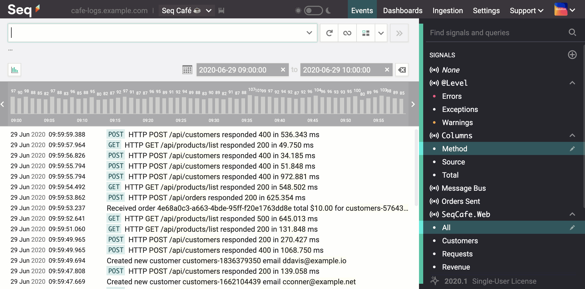
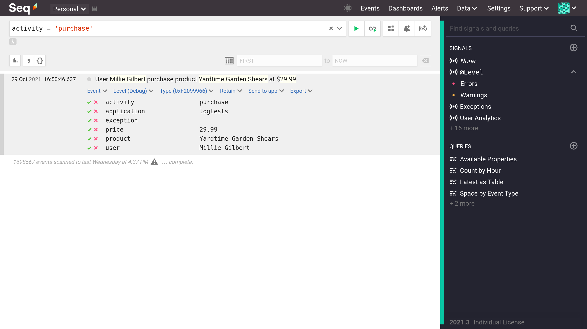

# `winston-seq` [](https://www.npmjs.com/package/@datalust/winston-seq)

A [Winston](https://github.com/winstonjs/winston) v3 transport that sends structured logs to the [Seq log server](https://datalust.co/seq).



## Install @datalust/winston-seq

```sh
$ npm install @datalust/winston-seq winston
# Or with yarn
$ yarn add @datalust/winston-seq winston
```

## Configure Logging

```ts
const winston = require('winston');
const { SeqTransport } = require('@datalust/winston-seq');
// or import { SeqTransport } from '@datalust/winston-seq';

const logger = winston.createLogger({
  level: 'info',
  format: winston.format.combine(  /* This is required to get errors to log with stack traces. See https://github.com/winstonjs/winston/issues/1498 */
    winston.format.errors({ stack: true }),
    winston.format.json(),
  ),
  defaultMeta: { /* application: 'your-app-name' */ },
  transports: [
    new winston.transports.Console({
        format: winston.format.simple(),
    }),
    new SeqTransport({
      serverUrl: "https://your-seq-server:5341",
      apiKey: "your-api-key",
      onError: (e => { console.error(e) }),
      handleExceptions: true,
      handleRejections: true,
    })
  ]
});
```

* `serverUrl` - the URL for your Seq server's ingestion
* `apiKey` - (optional) The [Seq API Key](https://docs.datalust.co/docs/getting-logs-into-seq#api-keys) to use
* `onError` - Callback to execute when an error occurs within the transport 
* `handleExceptions` - (optional) Send an event [when an uncaught exception occurs](https://github.com/winstonjs/winston#handling-uncaught-exceptions-with-winston)
* `handleRejections` - (optional) Send an event [when an unhandled promise rejection occurs](https://github.com/winstonjs/winston#handling-uncaught-promise-rejections-with-winston)

## Send Log Events

Send structured log events, with properties that can be used later for filtering and analysis:

```ts
logger.info("Hello {name}", {name: "World"});
```

Attach context by creating child loggers:

```ts
const taskLogger = logger.child({ activity: "purchase" });
taskLogger.debug(
    "User {user} purchase product {product} at ${price}", 
    {
        user: "Millie Gilbert",
        product: "Yardtime Garden Shears",
        price: 29.99
    });
```



## Contributing

[Install Yarn](https://yarnpkg.com/getting-started/install) if you don't already have it. Next, add a `.env` file with content like:

```
SEQ_INGESTION_URL=http://192.168.98.99:5341
SEQ_API_URL=http://192.168.98.99
SEQ_API_KEY=fsf7sa9f9sf7s9df7
```

Where `SEQ_INGESTION_URL` is the ingestion address of a test Seq server, `SEQ_API_URL` is the API address of the test server and `SEQ_API_KEY` is an [API key](https://docs.datalust.co/docs/getting-logs-into-seq#api-keys) with the `Ingest` and `Read` permissions. 

### Scripts

* To build:

```
$ yarn build
```

* To test:

```
$ yarn test
```

NB. One test will fail if the Seq server is configured to require an API key. 

* Calculate test coverage:

```
$ yarn test:coverage
```

* Lint source

``` 
$ yarn lint
```
